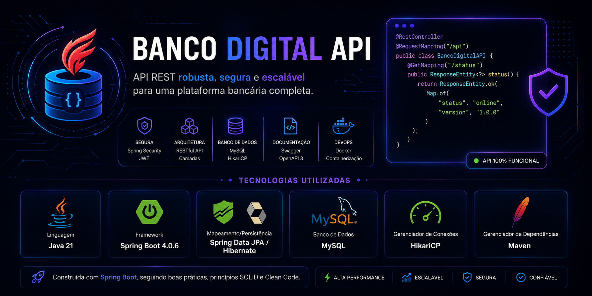

# 💰 Banco Digital API

<div align="center">
  

<br/><br/>

  

<br/><br/>


<br/><br/>


</div>

---

## 📋 Índice

- [Sobre o Projeto](#-sobre-o-projeto)
- [Diferenciais Exclusivos](#-diferenciais-exclusivos---front-end-embutido)
- [Tecnologias Utilizadas](#-tecnologias-utilizadas)
- [Estrutura do Projeto](#-estrutura-do-projeto)
- [Endpoints da API](#-endpoints-da-api)
- [Regras de Negócio](#-regras-de-negócio)
- [Tratamento de Exceções](#-tratamento-de-exceções)
- [Como Executar](#-como-executar)
  - [🐳 Via Docker (Recomendado)](#-via-docker-recomendado---produção)
  - [💻 Via IDE (Desenvolvimento)](#-via-ide-desenvolvimento-nativo)
- [Autor](#-autor)
- [Licença](#-licença)

---

## 🏦 Sobre o Projeto

O **Banco Digital API** é uma solução RESTful desenvolvida com **Spring Boot 4.x** e **Java 21**, projetada para simular operações bancárias essenciais do mundo real. O projeto aplica uma arquitetura robusta baseada na separação clara de responsabilidades entre as camadas de controle, regras de negócio e persistência de dados.

A aplicação utiliza um interceptador global de erros que captura falhas internas e as transforma em respostas padronizadas no formato JSON, garantindo previsibilidade para os consumidores da API. Além disso, conta com resiliência na inicialização e tratamento contra falhas temporárias de conexão com o banco de dados relacional.

> 💡 **Diferencial de portfólio:** O projeto conta com uma **Interface Client Interativa** integrada — servida diretamente pelo Spring Boot via recursos estáticos — que permite realizar requisições reais ao servidor e monitorar o status do ecossistema em tempo real, sem a necessidade de clients externos.

---
<!-- TODO: adicionar testes unitários com JUnit 5 e Mockito (#10) -->

## ✨ Diferenciais Exclusivos — Front-end Embutido

Esta API possui um front-end dinâmico servido diretamente na rota raiz da aplicação, facilitando a validação das regras de negócio:

| Funcionalidade do Client | Descrição |
|---|---|
| 🟢 **Status em Tempo Real** | Monitora a disponibilidade da API realizando polling assíncrono para o endpoint de consulta. |
| 📋 **Simulador REST — POST /contas** | Formulário estruturado que gera e dispara payloads em tempo real para criação de registros. |
| 🔍 **Busca de Conta — GET /contas/{numero}** | Localiza contas específicas de forma dinâmica através do identificador numérico. |
| 💰 **Depósito Integrado** | Permite simular operações de crédito em contas persistidas com atualização instantânea do saldo. |
| 💻 **Server Response Viewer** | Console embutido que renderiza o JSON bruto retornado pelos controllers da aplicação. |

> **Acesso:** Disponível em `http://localhost:8080` imediatamente após a inicialização da aplicação.

---

## 🛠️ Tecnologias Utilizadas

| Tecnologia | Versão | Finalidade |
|---|---|---|
| **Java** | 21 | Linguagem base e recursos modernos da plataforma |
| **Spring Boot** | 4.0.6 | Framework principal e gerenciamento do ecossistema |
| **Spring Web** | — | Construção de endpoints REST de alta performance |
| **Spring Data JPA** | — | Abstração da camada de persistência de dados |
| **Hibernate** | — | Engine de mapeamento objeto-relacional (ORM) |
| **MySQL** | 8.0 | Banco de dados relacional para persistência transacional |
| **Lombok** | — | Eliminação de código boilerplate de encapsulamento |
| **Maven & Wrapper** | — | Automação de builds e gerenciamento de dependências integrado |
| **Docker & Compose** | — | Containerização isolada e orquestração de infraestrutura |

---

<!-- TODO: implementar paginação nos endpoints de listagem (#8) -->

## 📁 Estrutura do Projeto

```text
banco-digital-api/
├── src/
│   ├── main/
│   │   ├── java/
│   │   │   └── com/claudiocastro/banco/api/
│   │   │       ├── controller/
│   │   │       │   └── ContaController.java
│   │   │       ├── service/
│   │   │       │   └── ContaService.java
│   │   │       ├── repository/
│   │   │       │   └── ContaRepository.java
│   │   │       ├── model/
│   │   │       │   └── ContaCorrente.java
│   │   │       └── exception/
│   │   │           ├── GlobalExceptionHandler.java
│   │   │           └── ContaNaoEncontradaException.java
│   │   └── resources/
│   │       ├── static/
│   │       │   └── index.html
│   │       └── application.properties
│   └── test/
├── docker-compose.yml
├── Dockerfile
└── pom.xml
```

---

## 🔌 Endpoints da API

**Base URL:** `http://localhost:8080`

| Método | Endpoint | Descrição | Status de Sucesso |
|:---:|---|---|:---:|
| `GET` | `/contas` | Lista todas as contas cadastradas na base | `200 OK` |
| `POST` | `/contas` | Realiza a abertura de uma nova conta | `201 Created` |
| `GET` | `/contas/{numero}` | Localiza um registro pelo número identificador | `200 OK` |
| `POST` | `/contas/{numero}/deposito?valor=` | Processa um depósito transacional na conta informada | `200 OK` |

### 📦 Exemplo de Payload — Criar Conta

```json
{
  "titular": "Cláudio Castro",
  "tipo": "CORRENTE",
  "saldo": 500
}
```

### ✅ Exemplo de Resposta — Conta Criada

```json
{
  "numero": 1,
  "titular": "Cláudio Castro",
  "tipo": "CORRENTE",
  "saldo": 500.0
}
```
<!-- TODO: adicionar validação de CPF no cadastro de cliente (#12) -->
---

## 📐 Regras de Negócio

A entidade principal da aplicação é a `CONTA` (`tb_contas`), com os seguintes campos:

| Campo | Tipo | Restrição |
|---|---|---|
| numero | Long | Chave primária transacional gerada por auto-incremento |
| titular | String | Obrigatório, validação contra valores nulos ou vazios |
| tipo | String | Restrito aos tipos operacionais `CORRENTE` ou `POUPANÇA` |
| saldo | Double | Inicialização obrigatória maior ou igual a zero |

- **[DEPÓSITO]** — Operações de crédito exigem valores estritamente positivos. Valores menores ou iguais a zero disparam exceções de negócio interceptadas com status `400 Bad Request`.
- **[BUSCA]** — Se uma conta não for localizada pelo número informado, um erro padronizado é retornado com status `404 Not Found`.
- **[CRIAÇÃO]** — O número da conta é auto-incrementado pelo banco de dados; o cliente não deve informá-lo no payload.
- **[@GlobalExceptionHandler]** — Um interceptador global captura as exceptions da aplicação e as transforma em respostas JSON padronizadas para o consumidor da API.

---

## 🚨 Tratamento de Exceções

O interceptador global estruturado com `@RestControllerAdvice` captura falhas em tempo de execução e retorna payloads padronizados:

| Exceção | Status HTTP | Cenário Operacional |
|---|---|---|
| `ContaNaoEncontradaException` | `404 Not Found` | Tentativa de busca ou movimentação em conta inexistente |
| `IllegalArgumentException` | `400 Bad Request` | Parâmetros transacionais inválidos (ex: depósito ≤ 0) |
| `MethodArgumentNotValidException` | `400 Bad Request` | Payload enviado com dados malformados ou ausentes |
| `Exception` | `500 Internal Error` | Fallback de segurança para capturar e mascarar erros inesperados do servidor |

---

## 🚀 Como Executar

**Pré-requisitos**

- [Git](https://git-scm.com/)
- [Docker Desktop](https://www.docker.com/products/docker-desktop/) (Recomendado)
- [Java JDK 21+](https://adoptium.net/) instalado localmente (Apenas para execução via IDE)

```bash
# Clone o repositório
git clone https://github.com/claudiodeveloper-github/banco-digital-api.git

# Acesse a pasta raiz do projeto
cd banco-digital-api
```

---

### 🐳 Via Docker (Recomendado — Produção)

Este modo utiliza o Docker Compose para subir tanto a API em Spring Boot quanto o banco MySQL em containers isolados, aplicando regras de healthcheck para mitigar race conditions de conectividade.

```bash
# 1. Compile e gere o artefato executável utilizando o wrapper nativo
./mvnw clean package -DskipTests

# 2. Inicialize a infraestrutura orquestrada
docker compose up --build
```

A aplicação estará disponível para uso em: **http://localhost:8080**

**Comandos de encerramento:**

```bash
# Para parar os containers mantendo os dados
docker compose down

# Para parar os containers limpando os volumes do banco de dados
docker compose down -v
```

---

### 💻 Via IDE (Desenvolvimento Nativo)

Use este modo durante o desenvolvimento ativo. Requer JDK 21 e Maven instalados localmente. O banco MySQL pode ser provisionado via Docker separadamente.

**1.** Suba uma instância isolada do banco MySQL via Docker na porta `3307` com o schema correto:

```bash
docker run -d \
  --name mysql-banco-digital \
  -e MYSQL_ROOT_PASSWORD=Banco2026@ \
  -e MYSQL_DATABASE=banco_spring \
  -p 3307:3306 \
  mysql:8.0
```

**2.** Certifique-se de que o `application.properties` local aponta para a porta correta:

```properties
spring.datasource.url=jdbc:mysql://localhost:3307/banco_spring?allowPublicKeyRetrieval=true&useSSL=false&serverTimezone=UTC
spring.datasource.username=root
spring.datasource.password=${DB_PASSWORD}
```

**3.** Execute a aplicação utilizando o Maven Wrapper local:

```bash
./mvnw spring-boot:run
```

Acesse o client de demonstração diretamente no seu navegador: **http://localhost:8080**

---

## 👤 Autor

<div align="center">


**Cláudio G. S. Castro**
*Java Backend Developer em Formação*

Desenvolvedor Backend em formação com foco em Java e Spring Boot.
Construindo APIs robustas com boas práticas, aprendendo continuamente e enfrentando desafios reais.

[](https://www.linkedin.com/in/claudio-g-s-castro)
[](https://github.com/claudiodeveloper-github)
[](mailto:claudiodeveloper007@gmail.com)

</div>

---

## 📄 Licença

Este projeto está licenciado sob a licença **MIT** — veja o arquivo [LICENSE](LICENSE) para mais detalhes.

---

<div align="center">

*Feito com ☕ Java e muito aprendizado por **Cláudio G. S. Castro***

⭐ Se este projeto te ajudou ou te inspirou, deixa uma estrela no repositório!

</div>
